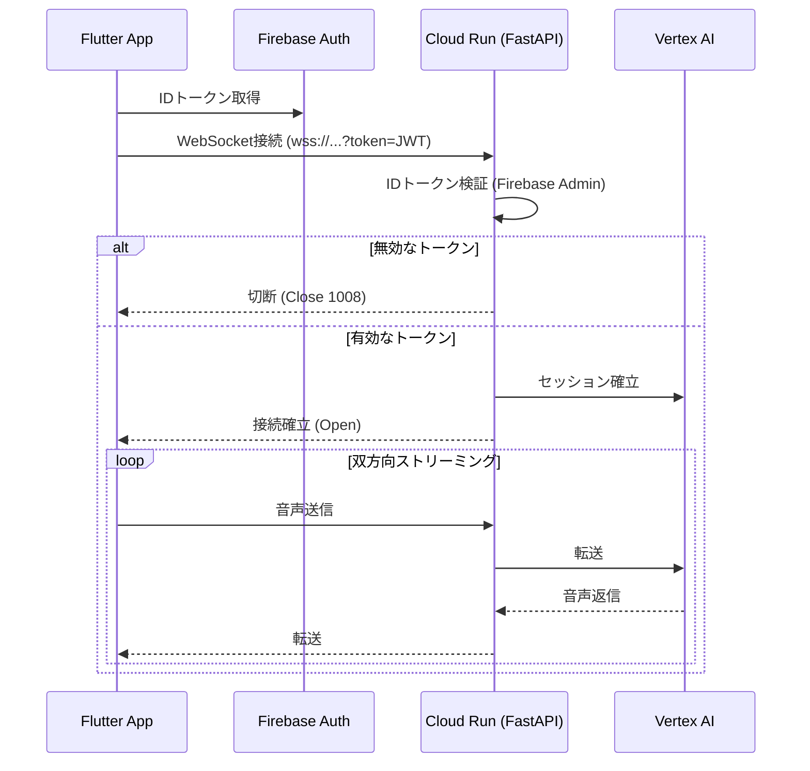

# Gemini Live Streaming Agent プロジェクト仕様

## 1. 概要

本プロジェクトは、Flutter (Web) と Python (FastAPI, ADK) を用い、リアルタイムの音声ストリーミング対話と、会話コンテキストに応じた画像生成が可能な Web アプリケーションを構築することを目的とする。

アーキテクチャは、Vertex AI Agent Engine 上で稼働する ADK エージェントを中核とし、Firebase Authentication による認証、Cloud Functions を介した一時トークンによる安全な WebSocket 接続、および Firestore と Cloud Storage を活用した非同期の画像生成ジョブ管理を特徴とする。

## 2. アーキテクチャ概要

- **クライアント:** Flutter (Web)
- **認証:** Firebase Authentication
- **バックエンド (BFF/Agent):** Cloud Run (FastAPI + ADK Runner)
- **リアルタイム通信:** WebSocket
- **AI モデル:** Gemini Live API (双方向ストリーミング)
- **データベース:** Cloud Firestore (UI用チャット履歴, 非同期ジョブ)
- **セッション/コンテキスト管理:** Vertex AI Agent Engine (VertexAISessionService)
- **ストレージ:** Cloud Storage for Firebase (生成画像)
- **デプロイ先:**
  - **フロントエンド:** Firebase Hosting
  - **ADK エージェント:** Cloud Run (FastAPI + ADK Runner)

## 3. 主要な技術スタック

- **フロントエンド:** Flutter (Web)
  - `firebase_core`, `firebase_auth`: Firebase 連携、認証
  - `cloud_firestore`: Firestore へのリアルタイム接続
  - `web_socket_channel`: WebSocket 通信管理
  - `flutter_sound`: (Web 対応) マイクからの生音声ストリーム取得、および音声再生
- **バックエンド:** Python (FastAPI)
  - `fastapi`: API サーバー構築 (BFF)
  - `websockets`: WebSocket エンドポイントの実装
  - `google-adk`: Gemini Live API との接続およびセッション管理
  - `vertexai`: Vertex AI Session Service の利用
- **認証:** Firebase Authentication
- **データベース:** Cloud Firestore
- **ストレージ:** Cloud Storage for Firebase
- **デプロイ:**
  - **フロントエンド:** Firebase Hosting
  - **バックエンド:** Cloud Run (FastAPI + ADK Runner)

### 3.1. 補足: Cloud Run デプロイ要件と Vertex AI
- **APP_NAME:** ADK の `Runner` 機能を使用する場合、アプリケーションを一意に識別する `APP_NAME` の定義が必須となる。
- **ランタイム構成:** Cloud Run 上で FastAPI を動かし、WebSocket 接続を終端する (BFFパターン)。
- **Vertex AI Agent Engine の利用:** エージェントのコード自体は Cloud Run に配置するが、**セッション履歴の管理 (Memory)** には `VertexAiSessionService` を利用する。そのため、**Vertex AI Agent Engine のインスタンス作成**が必須となる（コードのデプロイは不要）。
  - **重要**: `VertexAiSessionService` は**カスタム session_id をサポートしない**ため、セッション ID は必ずサービスによって自動生成される。フロントエンドの `chat_id` とバックエンドの `session_id` は異なる値となり、Firestore (`chats.sessionId`) でマッピングを管理する。


## 4. 接続シーケンスとアーキテクチャ (Cloud Run BFF パターン)

Flutterアプリ（フロントエンド）と Vertex AI Agent Engine（バックエンド）の接続には、**Cloud Run 上の FastAPI を WebSocket 中継サーバー (BFF: Backend For Frontend) として利用する構成**を採用する。

この構成では、認証に **Firebase Authentication の ID トークン** を直接利用し、シンプルかつ堅牢なセキュリティを実現する。

### 4.1. 接続・ストリーミングフロー

1.  **[認証]** ユーザーがアプリにログインし、Firebase Auth から **ID トークン** (JWT) を取得する。
2.  **[WebSocket 接続]** フロントエンドは取得した ID トークンをクエリパラメータ (`?token=...`) に付与し、**Cloud Run 上の FastAPI (BFF)** の WebSocket エンドポイントに接続する。
3.  **[トークン検証]** FastAPI は接続要求を受け取ると即座に ID トークンを検証する。無効な場合は接続を拒否 (403/1008) する。
4.  **[ストリーム中継]** 認証成功後、BFF は内部的に Gemini Live API (Vertex AI) とのセッションを確立し、フロントエンドからの音声/テキストと AI からの応答を**双方向に中継 (Proxy)** する。



### 4.2. Cloud Run の利点

*   **プロトコル変換:** Flutter から扱いやすい WebSocket を、Vertex AI が要求する gRPC/REST にサーバーサイドで変換できる。
*   **シンプルな認証:** 独自の一時トークン発行サーバーを立てる必要がなく、Firebase の標準的な認証フローで完結する。
*   **柔軟な制御:** Cloud Run は WebSocket の多数の同時接続 (Concurrent Requests) を効率的に処理でき、タイムアウト時間も設定で最大 60 分まで拡張可能。

**注意点:**
*   Cloud Run のサービス設定で、リクエストタイムアウトを想定される会話時間（例: 10分〜60分）に合わせて延長すること。
*   モバイル端末の切断に備え、フロントエンドには自動再接続ロジックを実装すること。

## 5. シーケンス: 画像生成 (Firestore, Cloud Storage 経緯)

1.  **[Gemini Live]** 会話の中で、Gemini が「（絵を描く）必要がある」と判断する。(例: 「ライオンさんの絵を描くね！」と発話する)
2.  **[ADK Agent]** (ADK の機能を利用し) Gemini のその判断（または特定のツールコール）を検知する。
3.  **[ADK Agent]** Gemini が生成した画像生成用プロンプトを取得する。
4.  **[ADK Agent]** Firestore の `jobs` コレクションに新しいドキュメントを作成する。
    - `status`: "pending"
    - `prompt`: "A friendly lion for a child"
    - `createdAt`: Timestamp
5.  **[Flutter]** Firestore の該当コレクションを `snapshots()` でリアルタイム監視（`StreamBuilder` など）している。
6.  **[Flutter]** `status: "pending"` の新しいジョブを検知し、UI に「絵を描き始めたよ...」などのインジケーターを表示する。
7.  **(別途のバックエンドプロセス or Cloud Function)** Firestore の `jobs` コレクションの `onCreate` トリガーが発火する。
8.  **[Backend Process]** 画像生成 API (Imagen 等) を呼び出し、生成された画像を **Cloud Storage for Firebase** にアップロードする。
9.  **[Backend Process]** アップロードした画像の**ダウンロード URL**を生成し、`jobs` ドキュメントを更新する。
    - `status`: "completed"
    - `downloadUrl`: "https://firebasestorage.googleapis.com/..." (永続的な公開 URL)
10. **[Flutter]** `status: "completed"` への変更を検知し、UI 上のインジケーターを `Image.network(job.downloadUrl)` を使って生成された画像に差し替える。

## 6. データモデル (Firestore)

### 概要

Firestore のデータモデルは、将来的な機能拡張性とクエリの効率を考慮し、正規化された構造を採用します。ユーザー、会話セッション、メッセージ、ツール、非同期ジョブをそれぞれ独立したコレクションで管理します。

### 1. `users` コレクション

Firebase Authentication で認証されたユーザーの情報を保持します。ドキュメント ID は Firebase Auth の UID とします。

```
/users/{user_id}
  - displayName: string      // 表示名
  - createdAt: timestamp     // アカウント作成日時
```

### 2. `chats` コレクション

個々の会話セッションのメタデータを保持します。

```
/chats/{chat_id}
  - userId: string           // 所有者のID (users/{user_id}への参照)
  - title: string            // AIによって生成された会話の要約タイトル
  - sessionId: string | null // ADK セッション ID（VertexAiSessionService が自動生成）
  - createdAt: timestamp     // 会話開始日時
  - updatedAt: timestamp     // 最終更新日時
```

> **Note**: `chat_id` はフロントエンドで生成される UUID、`sessionId` は ADK (VertexAiSessionService) が自動生成する ID です。両者は異なる値であり、Firestore でマッピングを管理します。

### 3. `messages` サブコレクション

特定の会話に含まれる全てのメッセージを時系列で保持します。

```
/chats/{chat_id}/messages/{message_id}
  - role: string             // "user" | "model" | "tool" (発言者)
  - content: string          // メッセージ内容 or ツールの実行結果
  - toolCalls: array | null  // (role: "model" の場合) モデルが呼び出したツールの情報
    - toolName: string       // 呼び出したツール名
    - jobId: string          // 非同期ジョブのID (image_jobs/{job_id}への参照)
  - createdAt: timestamp     // 送信日時
```

### 4. `image_jobs` コレクション

画像生成のような非同期で実行されるジョブの状態を管理します。フロントエンドはこれを監視してリアルタイムに UI を更新します。

```
/image_jobs/{job_id}
  - userId: string           // ジョブを開始したユーザー
  - chatId: string           // 関連する会話
  - messageId: string        // 関連するメッセージ
  - prompt: string           // 画像生成に使用されたプロンプト
  - status: string           // "pending" | "processing" | "completed" | "failed"
  - imageUrl: string | null  // 生成が完了した画像のURL
  - error: string | null     // 失敗した場合のエラーメッセージ
  - createdAt: timestamp     // ジョブ作成日時
  - updatedAt: timestamp     // ジョブ状態の最終更新日時
```

## 7. 開発原則・コーディング規約

### 7.1. 全般

- **非推奨の記法:** Python および Flutter に関して、2025 年 10 月末時点で公式に非推奨 (deprecated) となっている記法やライブラリの機能は使用しないこと。
- **AI 駆動開発:** コード生成を依頼する際は、本ドキュメント (`AGENTS.md`) をコンテキストとして参照すること。タスクは小さく、具体的に指示すること。AI が生成したコードは必ずレビューし、本規約に準拠しているか確認すること。
- **最新情報の参照:** 本プロジェクトは最新の技術スタックを採用しているため、調査や実装の際には、Web 検索や公式ドキュメントの最新版を積極的に参照すること。
- **不明な情報の明言:** わからないことや未確認の情報は、必ず「現時点では不明です」「確認できませんでした」と明言します。
- **推測の明示:** 推測を含む場合は、必ず「これは推測ですが、」と前置きします。
- **出典の添付:** 回答には、必ず情報の根拠となる出典（可能な限り一次情報）を添付します。

### 7.2. Python (Backend / FastAPI)

- **前提バージョン:** **Python 3.13 以降**を前提とする。
- **パッケージ管理:** Python のパッケージ管理には、Astral 社が開発する高速なパッケージマネージャー [`uv`](https://github.com/astral-sh/uv) を使用すること。
- **スタイルガイド:** [Google Python スタイルガイド](https://google.github.io/styleguide/pyguide.html) および [PEP 8](https://peps.python.org/pep-0008/) に準拠すること。
- **型ヒント (PEP 585, 604, 695):**
  - **全ての**関数定義（引数、戻り値）および主要な変数宣言には、型ヒントを**必須**とする。
  - `typing.List`, `typing.Dict`, `typing.Tuple` は**使用禁止**とする。代わりに `list[str]`, `dict[str, int]`, `tuple[int, ...]` のような組み込みジェネリクス (PEP 585) を使用すること。
  - `typing.Union` および `typing.Optional` は**使用禁止**とする。代わりに `str | int` や `str | None` のような `|` (Union 演算子, PEP 604) を使用すること。
  - ジェネリック関数やクラスの定義には、**PEP 695** 構文を**最優先で使用**すること。(例: `def my_func[T](arg: T) -> T:` や `class MyClass[T]:`)。
  - `typing.TypeVar` の使用は、PEP 695 で対応できない高度なケース（`TypeVarTuple` や `ParamSpec` など）に限定すること。
- **非同期処理 (Async/Await):**
  - I/O 処理（Gemini API へのリクエスト、Firestore へのアクセス、WebSocket 通信）は、**必ず** `async def` と `await` を使用した非ブロッキング処理とすること。
  - CPU バウンドな重い計算（万が一発生する場合）は、`async def` 内で直接実行せず、FastAPI の `run_in_threadpool` などを介して別スレッドで実行すること。
  - `time.sleep()` のようなブロッキング呼び出しは `async def` 内で**絶対に使用しない**こと。代わりに `await asyncio.sleep()` を使用すること。
- **FastAPI:**
  - データモデル（リクエストボディ、レスポンスモデル）には Pydantic の `BaseModel` を使用し、型検証を徹底すること。
  - ビジネスロジックをルート関数 (`@app.post(...)`) 内に直接記述せず、`services` や `use_cases` などの別レイヤーに分離すること。

### 7.3. Flutter (Frontend / Web)

- **スタイルガイド:** [Effective Dart](https://dart.dev/guides/language/effective-dart) の規約に準拠すること。
- **型指定:**
  - **ローカル変数**では、[Effective Dart の推奨](https://dart.dev/guides/language/effective-dart/language/variables#use-var-and-final-for-local-variables)に従い `var` や `final` を使用する。
  - ただし、型が推論しにくい場合（例: `var` では `dynamic` になってしまう場合）や、**クラスのフィールド（状態）**を定義する場合は、**必ず明示的な型**（`String`, `int`, `List<Job>`）を使用すること。
- **イミュータビリティ (Immutability):**
  - データモデル（`Job` など）は、`freezed` パッケージを利用し、**イミュータブル（不変）**なクラスとして定義すること。
  - `const` キーワードを最大限活用すること。特に `StatelessWidget` 内の `Padding` や `SizedBox` などの静的なウィジェットには `const` を付与し、不要なリビルドを徹底的に避けること。
- **ウィジェット:**
  - `build` メソッドは純粋（ロジックを含まない）に保つこと。
  - ウィジェットツリーが深くなる場合は、`builder` やメソッド (`_buildMyWidget()`) に切り出すのではなく、**新しい `StatelessWidget` / `ConsumerWidget` としてクラスを分離**すること。
  - `ListView.builder` や `GridView.builder` を積極的に使用し、画面外のウィジェットをビルドしないこと。
- **状態管理:**
  - 状態管理には **Riverpod** を使用し、ウィジェットツリーからビジネスロジックを分離すること。
  - `setState()` を持つ `StatefulWidget` の使用は、フォームの入力テキストやローカルな UI アニメーションなど、局所的な状態に限定すること。
- **非同期処理:**
  - `FutureProvider` や `StreamProvider` を活用し、`FutureBuilder` / `StreamBuilder` の手動管理を可能な限り避けること。

## 8. 参考情報

- **ADK Bidi-streaming (live) Overview:**

  - [https://google.github.io/adk-docs/streaming/](https://google.github.io/adk-docs/streaming/)
  - ADK における双方向ストリーミング機能の全体像とアーキテクチャに関する公式ドキュメント。

- **Streaming Quickstart:**

  - [https://google.github.io/adk-docs/get-started/streaming/quickstart-streaming/](https://google.github.io/adk-docs/get-started/streaming/quickstart-streaming/)
  - ADK のストリーミング機能を試すための公式クイックスタートガイド。

- **Custom Streaming with WebSocket:**
  - [https://google.github.io/adk-docs/streaming/custom-streaming-ws/](https://google.github.io/adk-docs/streaming/custom-streaming-ws/)
  - カスタム WebSocket サーバーを実装して ADK のストリーミング機能を利用する方法についての詳細なガイド。本プロジェクトのアーキテクチャに密接に関連する。
