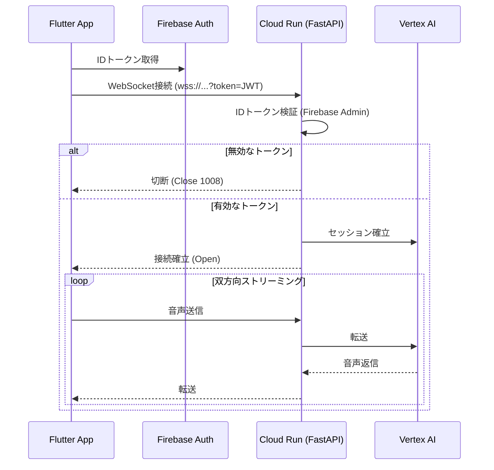

# coco-ai-bidi-streaming

Flutter (Web) と Python (FastAPI, ADK) を用いた、リアルタイムの音声ストリーミング対話と、会話コンテキストに応じた画像生成が可能な Web アプリケーションです。

## ディレクトリ構成

- `./app`: Flutter (Web) フロントエンドクライアント。UI、マイク入力、音声再生などを担当。
- `./agent`: Python (FastAPI, ADK) バックエンドエージェント。WebSocket接続管理とGemini Live APIとの音声ストリーム中継を担当。

## アーキテクチャ

### 概要

| コンポーネント | 技術 |
|---------------|------|
| クライアント | Flutter (Web) |
| 認証 | Firebase Authentication |
| バックエンド (BFF) | Cloud Run (FastAPI + ADK Runner) |
| リアルタイム通信 | WebSocket |
| AI モデル | Gemini Live API (双方向ストリーミング) |
| データベース | Cloud Firestore |
| セッション管理 | Vertex AI Agent Engine (VertexAiSessionService) |
| ストレージ | Cloud Storage for Firebase |

### Cloud Run BFF パターン

Flutterアプリと Vertex AI Agent Engine の接続には、Cloud Run 上の FastAPI を WebSocket 中継サーバー (BFF: Backend For Frontend) として利用します。認証には Firebase Authentication の ID トークンを直接利用し、シンプルかつ堅牢なセキュリティを実現します。



### Vertex AI Agent Engine

- エージェントのコードは Cloud Run に配置
- **セッション履歴の管理 (Memory)** には `VertexAiSessionService` を利用
- `VertexAiSessionService` は**カスタム session_id をサポートしない**ため、セッション ID は自動生成される
- フロントエンドの `chat_id` とバックエンドの `session_id` は異なる値となり、Firestore (`chats.sessionId`) でマッピングを管理

## データモデル (Firestore)

### 1. `users` コレクション

```
/users/{user_id}
  - displayName: string      // 表示名
  - createdAt: timestamp     // アカウント作成日時
```

### 2. `chats` コレクション

```
/chats/{chat_id}
  - userId: string           // 所有者のID
  - title: string            // AIによって生成された会話の要約タイトル
  - sessionId: string | null // ADK セッション ID（自動生成）
  - createdAt: timestamp     // 会話開始日時
  - updatedAt: timestamp     // 最終更新日時
```

> **Note**: `chat_id` はフロントエンドで生成される UUID、`sessionId` は ADK が自動生成する ID です。

### 3. `messages` サブコレクション

```
/chats/{chat_id}/messages/{message_id}
  - role: string             // "user" | "model" | "tool"
  - content: string          // メッセージ内容
  - toolCalls: array | null  // モデルが呼び出したツールの情報
    - toolName: string
    - jobId: string          // image_jobs/{job_id}への参照
  - createdAt: timestamp     // 送信日時
```

### 4. `image_jobs` コレクション

```
/image_jobs/{job_id}
  - userId: string           // ジョブを開始したユーザー
  - chatId: string           // 関連する会話
  - messageId: string        // 関連するメッセージ
  - prompt: string           // 画像生成に使用されたプロンプト
  - status: string           // "pending" | "processing" | "completed" | "failed"
  - imageUrl: string | null  // 生成が完了した画像のURL
  - error: string | null     // 失敗した場合のエラーメッセージ
  - createdAt: timestamp     // ジョブ作成日時
  - updatedAt: timestamp     // ジョブ状態の最終更新日時
```

## 画像生成フロー

1. **[Gemini Live]** 会話の中で、Gemini が画像生成が必要と判断
2. **[ADK Agent]** 画像生成ツールコールを検知し、プロンプトを取得
3. **[ADK Agent]** Firestore の `image_jobs` に新しいドキュメントを作成 (`status: "pending"`)
4. **[Flutter]** Firestore を `snapshots()` でリアルタイム監視、ジョブを検知しインジケーターを表示
5. **[Backend]** 画像生成 API を呼び出し、Cloud Storage にアップロード
6. **[Backend]** `image_jobs` を更新 (`status: "completed"`, `imageUrl` を設定)
7. **[Flutter]** ステータス変更を検知し、生成画像を表示

## 参考情報

- [ADK Bidi-streaming (live) Overview](https://google.github.io/adk-docs/streaming/) - 双方向ストリーミング機能の全体像
- [Streaming Quickstart](https://google.github.io/adk-docs/get-started/streaming/quickstart-streaming/) - 公式クイックスタートガイド
- [Custom Streaming with WebSocket](https://google.github.io/adk-docs/streaming/custom-streaming-ws/) - カスタム WebSocket 実装ガイド

---

## Cloud Shell でのセットアップ手順

`config.sh` と `initial_setup_infra.sh` を使用して、Google Cloud プロジェクトの初期設定を行う手順です。

1.  Cloud Shell を開き、`config.sh` と `initial_setup_infra.sh` をアップロードします。
2.  以下のコマンドを実行して、権限の設定とスクリプトの実行を行います。

```bash
# 実行権限の付与 (アップロード直後は権限がない場合があるため必須)
chmod +x config.sh initial_setup_infra.sh

# プロジェクトIDの設定 (ご自身のプロジェクトIDに置き換えてください)
export GOOGLE_CLOUD_PROJECT="YOUR_PROJECT_ID"

# インフラセットアップスクリプトの実行
./initial_setup_infra.sh
```

> **Note**: `YOUR_PROJECT_ID` は実際の Google Cloud プロジェクト ID に置き換えてください。

## 手動設定手順 (スクリプト実行後)

`initial_setup_infra.sh` の実行後、以下の手順を手動で行う必要があります。

### 1. Secret Manager の値設定
スクリプトはプレースホルダー値でシークレットを作成します。Google Cloud コンソールの Secret Manager から、以下のシークレットに正しい値を設定（新しいバージョンを追加）してください。

- `FIREBASE_API_KEY`
- `FIREBASE_APP_ID`
- `FIREBASE_MESSAGING_SENDER_ID`
- `FIREBASE_PROJECT_ID`
- `FIREBASE_STORAGE_BUCKET`
- `FIREBASE_AUTH_DOMAIN`

### 2. Firebase Storage へのバケットインポート
スクリプトで作成された GCS バケットを Firebase SDK から利用可能にするため、Firebase コンソールでインポートが必要です。

1. Firebase コンソール を開きます。
2. 左メニューの **Storage** を選択します。
3. **「バケットをインポート」** (または類似のオプション) を選択し、スクリプトで作成されたバケット (`YOUR_PROJECT_ID-generated-images`) を選択してインポートします。

### 3. Vertex AI Agent Engine の手動作成
セッション管理用の Agent Engine インスタンスは、現時点で `gcloud` コマンドだけで作成することが難しいため、以下の Python スクリプトを実行して作成してください。

この方法では、`identity_type=AGENT_IDENTITY` を使用して**コードをデプロイせずにIDのみを持つインスタンス**を作成します。これにより、事前にIAM権限を設定することが可能です。

Cloud Shell またはローカル環境で、`google-cloud-aiplatform` ライブラリをインストール後に実行します。

```bash
pip install google-cloud-aiplatform
```

```python
import vertexai
from vertexai import types
import os

# プロジェクトIDとロケーションを設定
PROJECT_ID = os.environ.get("GOOGLE_CLOUD_PROJECT", "YOUR_PROJECT_ID")
LOCATION = "asia-northeast1"

# Clientの初期化 (v1beta1 APIを使用)
client = vertexai.Client(
    project=PROJECT_ID,
    location=LOCATION,
    http_options=dict(api_version="v1beta1")
)

# Agent Engine インスタンスの作成 (コードなし、IDのみ)
try:
    print("Creating Agent Engine (Identity Only)...")

    remote_agent = client.agent_engines.create(
        config={
            "identity_type": types.IdentityType.AGENT_IDENTITY
        }
    )

    print("✅ Created successfully.")
    print(f"Resource Name: {remote_agent.name}")

except Exception as e:
    print(f"Error creating Agent Engine: {e}")
```

> **Note**: 作成後に表示される `Resource Name` から Agent Engine ID (例: `1234567890123456789`) を取得し、`cloudbuild.yaml` の `_VERTEX_AI_AGENT_ENGINE_ID` に設定してください。

### 4. Cloud Build トリガーの手動作成
GitHub リポジトリとの連携およびトリガーの作成は手動で行う必要があります。

1. Google Cloud コンソールの Cloud Build トリガーページを開きます。
2. **「リポジトリを接続」** をクリックし、このプロジェクトの GitHub リポジトリを接続します。
3. **「トリガーを作成」** をクリックし、以下の設定でトリガーを作成します。
    - **名前**: `deploy-pipeline` (任意)
    - **イベント**: 例: ブランチへの push
    - **ソース**: 接続したリポジトリとブランチ (例: `main`)
    - **構成**: Cloud Build 構成ファイル (yaml または json)
    - **場所**: `cloudbuild.yaml` (リポジトリルート)
4. (オプション) 作成したトリガーを実行し、デプロイが成功することを確認します。
